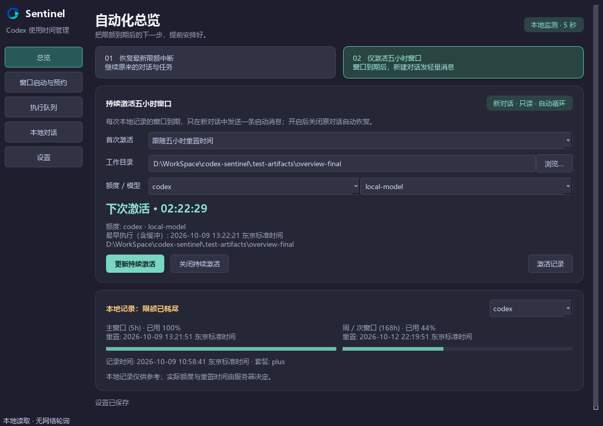

# Codex Sentinel 2.0

A local-first desktop quota dashboard, scheduled turn launcher, and conversation resumer for Codex.

[中文说明](README_zh.md) · [Implementation notes](docs/desktop-completion.md)


## Run

On Windows, extract `CodexSentinel-windows-x64-v<version>.zip` and open `CodexSentinel.exe`. Keep its `_internal` folder alongside it. Install and sign in to the official Codex CLI first; Sentinel detects it locally or accepts a path in Settings.

From source (Python 3.10+):

```sh
pip install -e '.[dev]'
python run_desktop.py
```

Installed commands:

```sh
codex-sentinel                     # Desktop by default
codex-sentinel-gui                 # Windowed entry point
codex-sentinel --gui --lang en
codex-sentinel --gui --dry-run      # Simulate without sending messages
codex-sentinel --daemon            # Legacy headless daemon
codex-sentinel --status            # Legacy one-time status check
```

Use `--buffer 30` / `--buffer 60` and `--prompt` to override desktop settings. GUI startup errors never silently fall back to a daemon that sends messages. `--no-relaunch` only affects the legacy daemon.

## Desktop features

- **Overview:** Two prominent workflows for conversation recovery and continuous window activation, with local quota groups, usage bars, reset dates, plan, and observation time. Missing values stay unknown; expired records are marked stale.
- **Automatic recovery:** Opt in to independently monitor the latest quota-interrupted user chat, identified by interruption time. Recovery never enters the manual queue. The overview immediately shows its full working directory and Codex display title when a new snapshot arrives, plus state, buffered countdown, and next locally recorded reset; a separate read-only history includes execution logs. Save prompt and buffer changes explicitly; the on/off switch saves immediately, and switching off stops an active recovery. The default buffer is 30 seconds, with a 60-second shortcut.
- **Continuous activation:** Opt in on the overview to send a fixed, lightweight message in a fresh, read-only conversation at each locally recorded five-hour reset, after the buffer. Choose the quota group, directory, and model; optionally schedule the first activation at a specific time. This mode turns off conversation recovery and runs independently of the manual queue. Each quota window is attempted once, with durable records preventing replay after a restart, failure, or cancellation. After a send it waits for a new local reset record; it never invents a reset five hours later. Exhausted weekly quota also delays activation. The automation history includes activation results and logs.
- **Recovery permissions:** Automatic recovery always requests workspace write access with Codex automatic approval reviews (`codex exec --approve-for-me`). Scheduled tasks remain read-only by default, with permissions chosen for each task. Writable execution requires a supporting CLI and fails before closing the desktop if unsupported. Approval rejection or unavailable quota can still interrupt execution; each log records the requested policy.
- **Window planner:** Choose a cached or manually entered model, existing/new conversation, working directory, message/task, and full date/time. Schedule at the next locally recorded five-hour reset, or send 2–3 hours before your planned work start.
- **Task queue:** Persist, edit, reorder, delete, reschedule, pause, stop, and inspect scheduled tasks and their logs. Queue pause does not pause automatic recovery or continuous activation. A shared executor finishes the current task before giving due recovery priority. Exhausted weekly quota also delays execution. By default, a busy target triggers closing Codex Desktop (interrupting its active tasks), waiting for the writer lock, running the task, cleaning up the CLI process group, then reopening the desktop. Disable this option in Settings to wait for the desktop instead.
- **Local conversations:** Read the full local index of unarchived interactive chats, use Codex display titles, and group them by saved project. Internal review/subagent logs are excluded from the picker. Search titles, models, directories, recorded token totals, and turn states.
- **Tray:** Closing hides the app when a system tray is available. Quit cancels the active child process and exits cleanly. Only one desktop instance runs per Sentinel data directory.



A scheduled message **does not guarantee a new five-hour window**. The server controls quota resets; Sentinel cannot reset an active window or skip a limit. It sends the chosen prompt after the recorded deadline plus a buffer and waits for new local records.

The computer must be awake and the app running. Manual schedules have a configurable five-minute grace period, after which they need explicit rescheduling. Failed or interrupted manual tasks never automatically replay. Automatic recovery rechecks the latest local interruption after waking, waits for every exhausted window and the buffer, and continues watching after completion. A renewed quota error waits for a new reset record; transient network errors retry at most twice, after 30 and 60 seconds. Successful, cancelled, approval-failed, or crash-interrupted recovery is not replayed for the same interruption. Inspect failed logs because partial work may have occurred. Lightweight messages time out after 120 seconds; tasks after one hour.

## Data and network

Monitoring reads only local `sessions/**/*.jsonl`, `state_5.sqlite` (read-only), `.codex-global-state.json` (project membership/order), and `models_cache.json` beneath `CODEX_HOME` (default `~/.codex`). Incremental scans cover the latest 100 rollouts, the latest 100 visible user conversations, and the active recovery target, every five seconds by default. The conversation picker reads the full index. Older unscanned turn states remain unknown. Sentinel makes no account/rate-limit polling requests and does not inspect credentials.

Only scheduled turns and resumes invoke the official CLI, which may make its normal authentication/model/network requests. Local snapshots may be stale, particularly after account/model changes. Without a reliable model-to-quota mapping, scheduling conservatively waits for all known exhausted windows.

Settings, schedules, recovery state/history (`recovery_state.json`), activation state/history (`activation_state.json`), and logs live in `~/.codex-sentinel` (`CODEX_SENTINEL_HOME` overrides it). Existing scheduled tasks retain their saved permissions and buffer; pending automatic recovery follows updated recovery settings. Old recovery queue entries move to the separate history, and only the latest eligible interruption is monitored. Corrupt files are reported, not silently overwritten.

The legacy `--daemon` retains its prior desktop takeover/relaunch behavior. Use the desktop mode for the new scheduler, durable execution records, and lock waiting.

## Test and build

```sh
pytest -q
python scripts/render_gui.py
```

Tests use isolated fixtures and fake executors; no real model requests. The renderer writes all five pages using synthetic data.

Windows build:

```powershell
.\.venv\Scripts\python.exe -m pip install pyinstaller
.\.venv\Scripts\python.exe scripts/build_windows.py
```

Outputs: `dist/desktop/CodexSentinel/` and `dist/CodexSentinel-windows-x64.zip`. Packaging smoke check: `CodexSentinel.exe --smoke-test` (opens then closes without monitoring or execution).

GitHub releases are triggered by pushing a `v<version>` tag that matches both `pyproject.toml` and `codex_sentinel/__init__.py`. Release titles, CI artifacts, and standalone downloads include the tag, for example `CodexSentinel-windows-x64-v2.0.3.zip`. Python wheels and source distributions retain their standard versioned filenames.

[MIT License](LICENSE).
