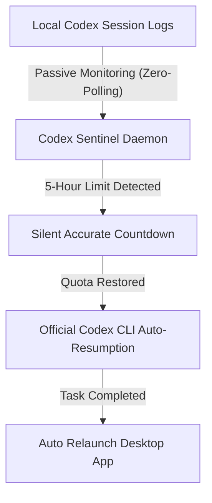
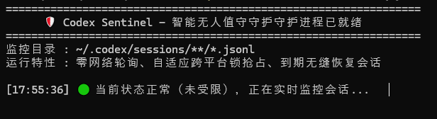
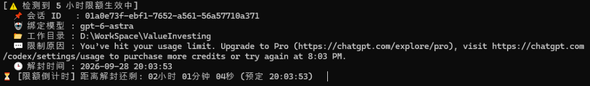

# Codex Sentinel 🛡️ - Never Get Blocked by OpenAI Codex's 5-Hour Rate Limit Again

[](https://github.com/isshui/codex-sentinel/actions/workflows/ci.yml)
[](https://github.com/isshui/codex-sentinel/actions/workflows/release.yml)
[](https://opensource.org/licenses/MIT)
[](https://www.python.org/)
[](#cross-platform-compatibility)

[中文说明文档 (README_zh.md)](README_zh.md)

> **Tired of waking up to "Usage limit reached" during overnight coding tasks?**  
> **Codex Sentinel** is a lightweight, unattended daemon that automatically monitors OpenAI Codex's 5-hour rolling limits, tracks exact cooldowns, and auto-resumes your interrupted sessions the exact second quota resets—enabling true overnight, hands-free development!

---

## 🎯 Key Features

- ⏳ **No More 5-Hour Limit Interruptions**: Automatically captures rate-limit cooldowns, tracks exact reset timestamps, and auto-resumes execution upon quota recovery.
- 🔄 **Seamless Hands-Free Handover**: Smoothly handles session continuity between Desktop and CLI without requiring human intervention.
- 🛡️ **Zero Network Polling & 100% ToS Compliant**: Passively monitors local session logs. Never pings OpenAI servers; safe and risk-free.
- 💻 **Standalone & Ready-to-Use**: Standalone Windows `.exe` (no Python needed) plus `pip install codex-sentinel`. Automatically re-opens Desktop App when finished.

---

## 🏗️ Workflow



---

## 📸 Screenshots

| Active Cruise Monitoring (Uncapped) | Rate-Limit Detected & Accurate Countdown |
| :---: | :---: |
|  |  |

---

## 🚀 Quick Start

### Prerequisites
- **Python >= 3.8** (Not required if using standalone `.exe` or pre-built binaries from Releases)
- **Official OpenAI Codex** (Desktop App automatically bundles the `codex` CLI; Sentinel auto-detects its location)

### Installation

```bash
# Clone the repository
git clone https://github.com/isshui/codex-sentinel.git
cd codex-sentinel

# Install in editable mode
pip install -e .
```

### Basic Usage

Start the sentinel daemon:
```bash
codex-sentinel
```

Check current rate limit status once:
```bash
codex-sentinel --status
```

### Command Line Options

```text
usage: codex-sentinel [-h] [-v] [--lang {auto,zh,en}] [--buffer BUFFER] [--prompt PROMPT] [--no-relaunch] [--dry-run] [--status]

Codex Sentinel: Intelligent unattended auto-resumer & writer-lock manager for OpenAI Codex.

options:
  -h, --help           Show this help message and exit
  -v, --version        Show program's version number and exit
  --lang {auto,zh,en}  Display language: 'auto' (detect system language), 'zh' (Chinese), or 'en' (English)
  --buffer BUFFER      Buffer wait seconds after resets_at before resuming CLI (default: 30)
  --prompt PROMPT      Custom prompt string for resuming session (defaults to localized system prompt)
  --no-relaunch        Do not automatically relaunch Desktop App after session finishes
  --dry-run            Simulate execution without terminating processes or calling CLI
  --status             Check and display rate limit status once and exit
```

---

## 💻 Cross-Platform Support

| Feature | Windows | Linux | macOS |
| :--- | :--- | :--- | :--- |
| **Session Log Path** | `%USERPROFILE%\.codex\sessions` | `~/.codex/sessions` | `~/.codex/sessions` |
| **Session State Handover** | Native Windows state checks | POSIX standard checks | POSIX standard checks |
| **Desktop App Relaunch** | Native Windows app protocol | System launcher | Native macOS app launch |
| **Sound Alert** | System beep | Terminal bell | Terminal bell |

---

## 🔒 Safety & Compliance

- **No API Reverse-Engineering**: All session metadata is read from official local `.jsonl` files stored on your disk.
- **Zero API Quota Wasted**: The daemon sleeps until the official `resets_at` timestamp. No pinging OpenAI servers.
- **No Data Leakage**: Sentinel runs entirely locally on your machine. No telemetry or external network calls.
- **Data Integrity**: Does not modify `.codex` SQLite databases or session transcripts; only triggers the official CLI.

---

## 🤝 Contributing & License

Contributions are welcome! Please feel free to submit a Pull Request or open an Issue.

Distributed under the **MIT License**. See [`LICENSE`](LICENSE) for details.
