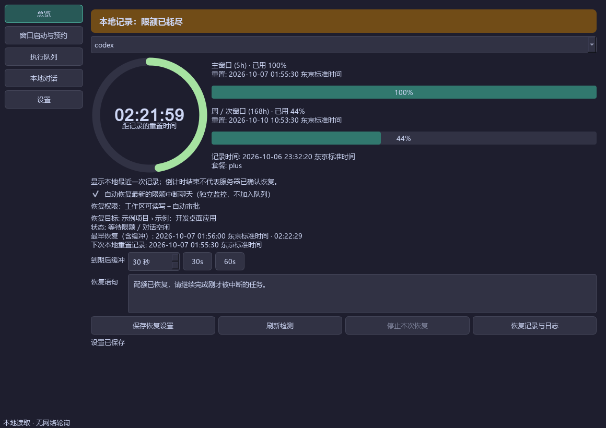

# Codex Sentinel 2.0

本地优先的 Codex 桌面限额看板、窗口启动预约和对话恢复工具。

[English](README.md) · [实现记录与后续优化](docs/desktop-completion.md)



## 启动

Windows 桌面包：解压 `CodexSentinel-windows-x64-v<version>.zip`，双击文件夹中的 `CodexSentinel.exe`。请保留旁边的 `_internal` 目录。需要已安装并登录的官方 Codex CLI；Sentinel 会自动查找，也可在设置中指定路径。

源码运行（Python 3.10+）：

```powershell
python -m venv .venv
.\.venv\Scripts\python.exe -m pip install -e '.[dev]'
.\.venv\Scripts\python.exe run_desktop.py
```

安装后的命令：

```text
codex-sentinel                  桌面界面（默认）
codex-sentinel-gui              无控制台桌面入口
codex-sentinel --gui --lang zh  中文界面
codex-sentinel --gui --dry-run  模拟执行，不发送消息
codex-sentinel --daemon        原有命令行守护模式
codex-sentinel --status        原有单次限额检查
```

`--buffer 30` / `--buffer 60` 指定缓冲，`--prompt` 指定恢复语句。GUI 启动失败会报错退出，不会自动切换成会发送消息的守护模式。`--no-relaunch` 仅用于原有守护模式；GUI 的桌面接管和重新打开选项在“设置”中调整。

## 使用

### 总览

- 显示本地记录的限额分组、五小时主窗口、周/次窗口、已用比例、重置日期时间、记录时间和套餐。
- 缺失数据显示未知；重置时间过去后标记记录过期，不会凭空将用量清零。
- 首次运行默认不勾选自动恢复。勾选后，独立监控扫描范围内最新的限额中断聊天，按实际中断时间选择，不加入执行队列，也不补跑更旧的聊天。
- 总览显示目标项目与 Codex 聊天标题、恢复状态、含缓冲的倒计时及下次本地重置记录。“刷新检测”重新读取本地记录；“恢复记录与日志”查看独立的只读历史。
- 自动恢复开关立即保存，关闭时会停止正在执行的自动恢复；恢复语句和缓冲需要点击“保存恢复设置”。默认缓冲 30 秒，可选 60 秒或自定义。
- 自动恢复固定使用**工作区可读写＋自动审批**（`codex exec --approve-for-me`）：保留工作区沙箱，由 Codex 自动审核 Git 提交等额外权限。需要支持该选项的 Codex CLI；不支持时会在关闭桌面之前报错。审批拒绝或配额不足仍可能中断任务，日志会记录每次启动请求的权限。预约任务的权限由用户逐项设置。
- 等待所有已知耗尽窗口恢复并经过缓冲后执行；结束后继续监控最新中断及下次重置。恢复时再次遇到限额，会等待新的本地重置记录；没有明确时间时保持等待，不推测新的五小时起点。
- 短暂网络错误最多重试两次，分别等待 30、60 秒。已完成、用户停止、权限失败及程序崩溃中断的同一次恢复不会自动重发。用户已继续或停止目标聊天时取消等待。

### 窗口启动与预约

1. 选择轻量启动消息或实际任务，选择模型、已有/新建对话、工作目录和语句。模型来自本地缓存；留空使用 Codex 默认，也可输入模型 ID。
2. 选择尽快执行、完整日期时间，或本地记录中的下一个五小时重置点。
3. 若希望正式工作时窗口大约剩三小时或两小时，可以设置“计划开始使用时间”，再点“提前2小时发送”或“提前3小时发送”。
4. 为该任务选择权限（默认只读，可启用工作区写入与自动审批），再保存到队列。对话选择按“文件夹 › Codex 标题”展示。最早执行时间为 `max(预约时间, 已知耗尽窗口重置时间) + 缓冲`；到时仍被占用的会话还需完成桌面交接并等待锁释放。

发送消息只是尝试让账号产生一次使用。**五小时窗口由服务器决定，Sentinel 不能保证一条消息开启新窗口，也不能提前重置或跳过限额。** 多条任务可以预约到下一个已知重置点。若周额度也耗尽，会继续等到周窗口恢复。

### 执行队列

- 队列只管理用户预约的任务，支持添加、编辑、排序、删除、重新排期、暂停队列执行及停止当前执行。自动恢复与队列共用一个执行器；当前执行结束后，已到期的自动恢复优先。
- 旧版本的恢复队列条目自动迁移到独立恢复历史，保留日志；普通预约保留原有权限与设置。
- 可查看提示词、工作目录、结果原因和 CLI 日志。
- 已完成、失败或中断的任务不会自动重发；需要手动重新排期。失败可能已经产生部分工作，请先查看日志。
- 对话被 Codex 桌面占用时，默认关闭识别出的桌面进程树（会中断其中正在执行的任务），确认锁释放后执行；任务结束后清理本次 CLI 及子进程，再重新打开桌面。可在“设置”关闭接管选项，恢复为等待占用释放。
- 实时识别本轮完成事件。完成后最多等待 CLI 正常退出 2 秒，再清理残留进程并验证锁释放；完成、失败、取消与超时都进行清理。Windows 使用 Job Object 管理本次启动的进程组。清理失败会同时暂停队列和自动恢复并显示原因。
- 暂停队列保留当前正在运行的任务，也不影响独立的自动恢复。要中止执行请点相应的停止按钮。

### 后台与休眠

关闭窗口默认进入系统托盘，托盘可重新打开、暂停或退出。无托盘的平台会正常退出。退出时停止当前 CLI 子进程并保存中断状态。

应用必须保持运行，电脑必须处于唤醒状态。普通预约错过时间默认有 5 分钟宽限；超出后标为“已错过”，需要手动重新排期。自动恢复不受队列宽限期限制，唤醒后重新检查最新中断和限额记录再决定是否执行。支持跨日期预约和恢复持久化状态；运行中崩溃的任务标为中断，不自动重发。

## 数据与网络

- 仅读取 `CODEX_HOME`（默认 `~/.codex`）中的 `sessions/**/*.jsonl`、`state_5.sqlite`、`.codex-global-state.json`（项目归属与排序）和 `models_cache.json`。SQLite 使用只读连接，字段兼容检测。增量扫描最近 100 个日志、最近 100 个可见用户聊天，并持续跟踪当前恢复目标；对话列表读取完整的本地未归档交互会话索引。
- 对话选择按 Codex 显示标题和项目分组，排除 Guardian review、子代理等内部日志。项目内按用户活动时间排列，兼容保存的手动顺序。未扫描到日志的旧对话状态保持“未知”。执行详情同时显示目标标题、目标会话 ID 和日志中的实际启动 ID，便于区分恢复目标与工具输出中提及的其他对话。
- 监控默认每 5 秒扫描本地文件，增量读取新增日志；不调用官方限额查询接口，不读取或展示认证凭据。
- 仅执行预约或恢复时调用官方 `codex exec` / `codex exec resume`。该 CLI 自身可能执行其正常的认证、模型和网络请求。
- 本地记录可能滞后，切换账号或模型后尤其如此。没有可靠的模型限额映射时，调度会保守等待所有已知耗尽窗口。
- 设置、队列、恢复状态与历史（`recovery_state.json`）及日志保存到 `~/.codex-sentinel`，可通过 `CODEX_SENTINEL_HOME` 指定独立目录。不会写入 Codex 数据库。
- 启动消息超时 120 秒；实际任务超时 1 小时。超时、失败都保留日志供手动判断。

## 开发与打包

```powershell
.\.venv\Scripts\python.exe -m pytest -q
.\.venv\Scripts\python.exe scripts/render_gui.py
.\.venv\Scripts\python.exe -m pip install pyinstaller
.\.venv\Scripts\python.exe scripts/build_windows.py
```

图形测试使用 Qt offscreen 和隔离数据，不调用真实模型。`scripts/render_gui.py` 使用示例数据生成五个页面截图。Windows 包输出为 `dist/desktop/CodexSentinel/`，压缩包为 `dist/CodexSentinel-windows-x64.zip`。

原有 `--daemon` 仍为旧实现。新增预约、日志去重、可配置的桌面交接与执行进程组清理由 GUI 提供。建议使用桌面模式。

推送 `v<version>` 标签会触发 GitHub 发布，标签版本必须与 `pyproject.toml` 和 `codex_sentinel/__init__.py` 中的版本一致。Release 标题、CI 构建产物和独立程序下载文件均带标签版本号，例如 `CodexSentinel-windows-x64-v2.0.3.zip`。Python wheel 和源码包保留标准的带版本号文件名。

MIT License，详见 [LICENSE](LICENSE)。
