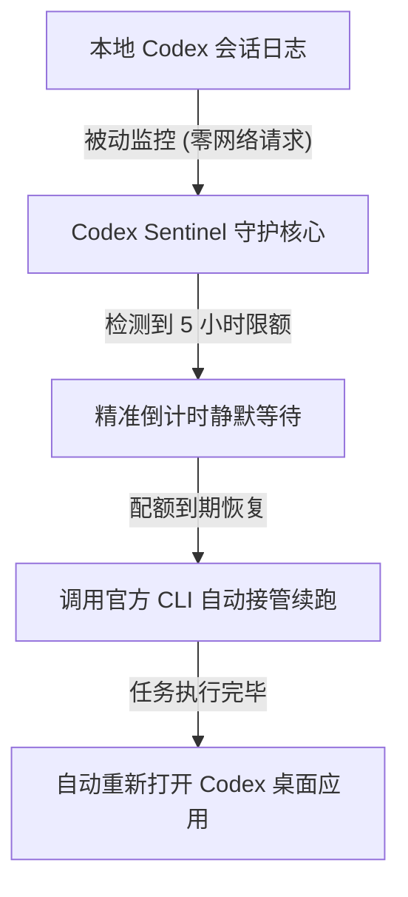

# Codex Sentinel 🛡️ - 告别 5 小时限额中断！OpenAI Codex 无人值守自动续跑神器

[](https://github.com/isshui/codex-sentinel/actions/workflows/ci.yml)
[](https://github.com/isshui/codex-sentinel/actions/workflows/release.yml)
[](LICENSE)
[](https://www.python.org/)

[English Documentation (README.md)](README.md)

> **你是否经历过深夜挂机让 Codex 跑长任务，早晨醒来却发现刚跑了 10 分钟就被 5 小时限额卡死，整夜毫无进展？**  
> **Codex Sentinel** 专为解决此痛点而生：**零网络轮询、智能静默倒计时、配额恢复瞬间全自动续跑**，真正实现无人值守通宵挂机！

---

## 🎯 核心特性

- ⏳ **告别 5 小时限额中断**：自动识别限额并计算官方解封时间，静默倒计时，配额恢复第一时间自动续跑。
- 🔄 **平滑无缝接管**：自动协调桌面端与命令行状态，无需人工守在电脑前手动点击恢复。
- 🛡️ **零网络轮询，100% 官方合规**：纯本地被动读取会话日志，不向 OpenAI 发送多余请求，安全可靠。
- 🖥️ **免配置即开即用**：提供 Windows 免安装单文件 `.exe`（双击即用），任务完成后可自动重新唤醒桌面客户端。

---

## 🏗️ 运行流程



---

## 🚀 快速上手

### 环境要求
- **Python >= 3.8**（若直接从 Release 下载免安装的 `.exe` / 单文件版，则**无需安装 Python**）
- **已安装官方 OpenAI Codex**（桌面客户端安装包已内置 `codex` CLI，Sentinel 亦支持自动探测定位）

### 安装方式

```bash
# 克隆仓库
git clone https://github.com/isshui/codex-sentinel.git
cd codex-sentinel

# 可编辑模式安装
pip install -e .
```

### 基础运行

直接启动守护进程：
```bash
codex-sentinel
```

仅查询当前会话限额状态并退出：
```bash
codex-sentinel --status
```

### 命令行参数详解

```text
用法: codex-sentinel [-h] [-v] [--lang {auto,zh,en}] [--buffer BUFFER] [--prompt PROMPT] [--no-relaunch] [--dry-run] [--status]

选项:
  -h, --help           显示帮助信息并退出
  -v, --version        显示版本号
  --lang {auto,zh,en}  显示语言: 'auto' (自动跟随系统), 'zh' (中文), 或 'en' (英文)
  --buffer BUFFER      达到 resets_at 后的额外网络缓冲秒数 (默认: 30 秒)
  --prompt PROMPT      续跑会话时传递给 Codex 的提示词 (默认自适应中英文系统)
  --no-relaunch        任务执行完毕后不自动重新打开桌面客户端
  --dry-run            模拟模式，仅打印倒计时，不终止进程也不调用 CLI
  --status             检查当前限额状态一次后立即退出
```

---

## 💻 跨平台特性一览

| 特性 | Windows | Linux | macOS |
| :--- | :--- | :--- | :--- |
| **会话日志路径** | `%USERPROFILE%\.codex\sessions` | `~/.codex/sessions` | `~/.codex/sessions` |
| **多端状态平滑协调** | Windows 原生状态校验 | POSIX 标准状态校验 | POSIX 标准状态校验 |
| **自动唤醒客户端** | Windows 原生唤醒 | 桌面程序唤醒 | macOS 原生唤醒 |
| **到期声音提醒** | 系统原生蜂鸣 | 终端蜂鸣 | 终端蜂鸣 |

---

## 🧪 测试与开发

本项目包含完整的单元测试（覆盖会话解析、限额提取、文件锁状态测试）：

```bash
# 安装开发依赖
pip install .[dev]

# 运行单元测试
pytest -v tests/
```

---

## 📄 开源许可

本项目采用 **MIT License**。详见 [LICENSE](LICENSE) 文件。
