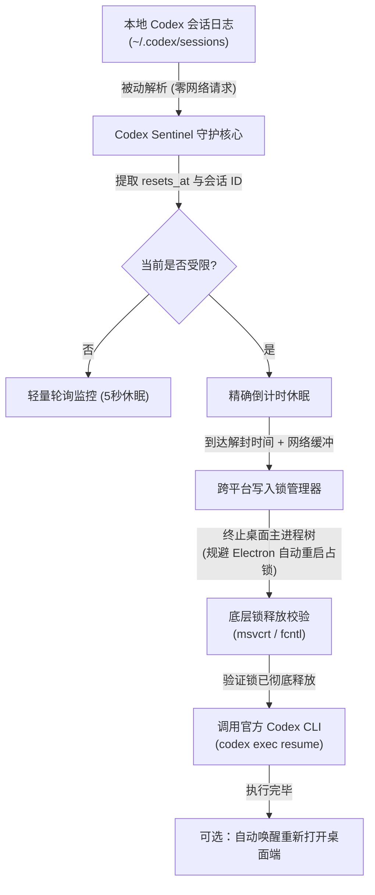

# Codex Sentinel 🛡️ - 告别 5 小时限额中断！OpenAI Codex 无人值守自动续跑神器

[](https://github.com/isshui/codex-sentinel/actions/workflows/ci.yml)
[](https://github.com/isshui/codex-sentinel/actions/workflows/release.yml)
[](LICENSE)
[](https://www.python.org/)

[English Documentation (README.md)](README.md)

> **痛点场景：你是否经历过深夜挂机让 Codex 跑长任务，第二天早晨醒来却发现第 10 分钟就被 5 小时限额中断？手动 Resume 还被写入锁死锁报错 `-32600`？**  
> **Codex Sentinel** 专为解决此痛点而生：**零网络轮询、本地被动监控、安全解除桌面进程锁、配额恢复瞬间全自动唤醒继续执行**，真正实现无人值守通宵挂机！

---

## 🎯 解决的核心痛点

在日常使用 OpenAI Codex 桌面端或 CLI 跑大型项目或夜间自动化任务时，常遇到以下痛点：

### 1. 5 小时滚动配额中断长任务
- 任务执行到一半触发 5 小时限额（Usage limit exceeded），Codex 立即中断。
- 开发者必须守在电脑前手动查看到期时间，或第二天早晨发现任务停滞在数小时前。

### 2. 写入锁死锁与 Electron 自动重启陷阱（Bug -32600）
- Codex 桌面客户端基于 Electron 架构（如 `ChatGPT.exe`），它作为父进程监督着后端的 `codex.exe app-server`。
- 后端服务独占占有 `~/.codex/thread-writer-locks/<session_id>.lock`。
- **陷阱机制**：若仅使用脚本杀死 `codex.exe`，Electron 主进程的崩溃重启机制会在数十毫秒内重新拉起新的 `codex.exe`，导致文件锁被重新独占抢占。
- 当 CLI 尝试恢复时，Rust 存储层检测到冲突并报错：
  ```text
  ERROR codex_core::session: thread-store conflict: thread ... already has an active writer (code -32600)
  ```
- **Sentinel 解法**：自动对主进程树进行彻底的连带退出（`taskkill /F /T` 或 POSIX 信号），配合底层的真实锁占用状态轮询校验，确保 100% 独占释放后再交由官方 CLI 接管。

### 3. 零网络轮询与 100% 官方合规
- **不抓包、不逆向 API、不频繁请求服务端**。
- 被动解析本地滚动的 `~/.codex/sessions/**/*.jsonl` 日志，读取官方下发的 `resets_at` 精确时间戳。
- 受限期间本地静默休眠倒计时，到期后直接调用官方公开的 `codex exec resume` 命令行。

---

## 🏗️ 架构与运行流程



---

## 🚀 快速上手

### 环境要求
- **Python >= 3.8**（若直接从 Release 下载免安装的 `.exe` / 单文件版，则**无需安装 Python**）
- **已安装官方 OpenAI Codex**（桌面客户端安装包已内置 `codex` CLI，Sentinel 亦支持自动探测定位）

### 安装方式

```bash
# 克隆仓库
git clone https://github.com/isshui/codex-sentinel.git
cd codex-sentinel

# 可编辑模式安装
pip install -e .
```

### 基础运行

直接启动守护进程：
```bash
codex-sentinel
```

仅查询当前会话限额状态并退出：
```bash
codex-sentinel --status
```

### 命令行参数详解

```text
用法: codex-sentinel [-h] [-v] [--lang {auto,zh,en}] [--buffer BUFFER] [--prompt PROMPT] [--no-relaunch] [--dry-run] [--status]

选项:
  -h, --help           显示帮助信息并退出
  -v, --version        显示版本号
  --lang {auto,zh,en}  显示语言: 'auto' (自动跟随系统), 'zh' (中文), 或 'en' (英文)
  --buffer BUFFER      达到 resets_at 后的额外网络缓冲秒数 (默认: 30 秒)
  --prompt PROMPT      续跑会话时传递给 Codex 的提示词 (默认自适应中英文系统)
  --no-relaunch        任务执行完毕后不自动重新打开桌面客户端
  --dry-run            模拟模式，仅打印倒计时，不终止进程也不调用 CLI
  --status             检查当前限额状态一次后立即退出
```

---

## 💻 跨平台适配一览

| 特性 | Windows | Linux | macOS |
| :--- | :--- | :--- | :--- |
| **会话日志路径** | `%USERPROFILE%\.codex\sessions` | `~/.codex/sessions` | `~/.codex/sessions` |
| **底层文件锁校验** | `msvcrt.locking` | `fcntl.flock` | `fcntl.flock` |
| **进程树清理** | `taskkill /F /T` + `psutil` | `pkill` / `SIGTERM` / `SIGKILL` | `pkill` / `SIGTERM` |
| **自动唤醒客户端** | Shell UWP 唤醒协议 | `gtk-launch` / 可执行程序 | `open -a ChatGPT` |
| **到期声音提醒** | `winsound.Beep` | 终端铃声 `\a` | 终端铃声 `\a` |

---

## 🧪 测试与开发

本项目包含完整的单元测试（覆盖会话解析、限额提取、文件锁状态测试）：

```bash
# 安装开发依赖
pip install .[dev]

# 运行单元测试
pytest -v tests/
```

---

## 📄 开源许可

本项目采用 **MIT License**。详见 [LICENSE](LICENSE) 文件。
