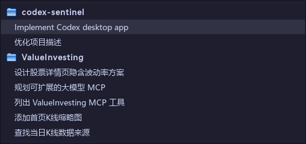

# 本地对话列表与 Codex 侧栏对照

核查日期：2026-10-03（Asia/Tokyo）。

## 原因

旧实现按文件修改时间选择最近 100 个 JSONL，再为这些文件补标题。内部 Guardian review 和子代理也拥有日志，因此进入了下拉列表；旧的正常对话则可能被挤出。仅把 `title` 改成 `name` 无法修正成员、项目和顺序。

## 核查依据

读取了本机安装包 `OpenAI.Codex_26.928.2636.0_x64__2p2nqsd0c76g0/app/resources/app.asar` 内的编译代码，未修改安装包：

- `webview/assets/app-shared-a906948d8868.js`：`listRecentThreads` 使用非归档、交互来源和 `recency_at` 排序；`H4t` 优先使用 `name`，无名称时回退预览。`mP=[]` 交由 App Server 使用默认交互来源。
- `webview/assets/app-initial-fd3c4b862660.js`：项目分组读取项目归属、无项目标记、工作目录提示；排序显示的 Updated 使用 `recencyAt` 优先于 `updatedAt`。项目列表顺序独立保存。
- [官方 App Server 协议源码](https://github.com/openai/codex/blob/main/codex-rs/app-server-protocol/src/protocol/v2/thread.rs) 和 [官方列表接口说明](https://learn.chatgpt.com/docs/app-server#list-threads-with-pagination--filters)：核对 `sourceKinds` 默认交互来源、`archived` 与排序字段。
- 只读核对本机 SQLite 与 `.codex-global-state.json`。实际正常对话的 `has_user_event` 也有 0，因此没有使用此字段过滤。

## 修正与验证

1. 独立构建完整本地索引：先排除已归档、非交互及内部会话，再显示标题；最近 100 个日志的增量限额扫描保持独立。
2. 项目归属优先读取持久化分配，兼容数据库项目迁移 ID、工作目录提示、Windows 扩展路径和子目录。用文件夹标题分组，文件夹行不可作为恢复目标；实际执行仍使用完整会话 ID。
3. 截图中的 codex-sentinel 两个标题、ValueInvesting 前五个标题已逐项核对，分组和顺序一致。完整下拉菜单也提供更早对话，不复制 Codex 每组默认只显示五项的折叠界面。
4. 日志详情显示目标标题、目标 ID，以及从日志开头读取的 `thread.started.thread_id`，避免日志末尾截取后无法辨认执行目标。队列中的对话列也显示标题，悬停查看 ID。

当前只覆盖本机 Codex 会话；不请求云端列表，也不复制官方界面的实时状态、跨主机、置顶和自定义分区布局。未扫描到的旧日志状态保持未知。

验证：43 项 pytest 测试通过；覆盖内部日志挤占、归档过滤、显示名、项目排序、ID 保持、长日志目标显示；本机七个截图标题及顺序核对通过。仅使用只读扫描和模拟执行测试，没有向其他对话发送消息。
